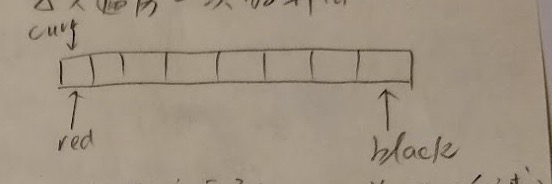

## 1. iHandy

为什么 Android 要设计 Intent Service？直接使用线程不就行了？

> 考点：Intent Service 和线程的区别
> 答：Thread 依赖于 Activity 存在，在 Activity finish 的时候 Thread 必须终止，否则会造成内存泄漏
> Intent Service 不依赖于 Activity 存在，当 Activity 关闭之后，它依旧会继续进行，指导任务完成或者系统强制将其回收

按下 App 强制停止，发生了什么？

> 调用了 forceStopPackage()

跨进程单例实现

> 使用 AIDL 接口实现一个单例，然后制定一个进程存储（实现）这个单例，其他进程连接这个 Service 获取其 Binder

## 2. 头条

[荷兰国旗问题](https://leetcode.com/problems/sort-colors/)

只遍历一次的算法



`curr` 从前往后遍历：

1. 如果遍历到白球，`curr++`
2. 如果遍历到红球，则与 `red` 交换，然后 `red++`，`curr++`
3. 如果遍历到黑球，则与 `black` 交换，`black--`，**`curr` 不动**

`curr` 表示 **前面已经排好了**，和后面交换并不保证前面已经排好

HTTPS 通信流程

> HTTPS 全称是：HTTP over TLS

```plantuml
客户端->服务端: 发起请求，包括协议版本，支持算法和随机函数 random1
服务端->客户端: 确认版本，随机数 random2 和支持算法
服务端->客户端: 发送服务器公钥证书
客户端->客户端: 验证证书签名
客户端->客户端: 生成随机数 random3 并通过服务器公钥加密生成 premaster
客户端->服务端: 加密后的 premaster
服务端->服务端: 用私钥解密 premaster，获取 random3
客户端->客户端: 使用 random1 random2 random3 生成对称加密秘钥
服务端->服务端: 使用 random1 random2 random3 生成对称加密秘钥
客户端->服务端: 使用对称加密秘钥进行加密通信
```


HTTPS 的验证过程如何防止中间人攻击？中间人偷换公钥怎么办？

> 搞清楚几个问题：
> 1. 服务器 SSL 证书是怎么来的？
> -> 是从 CA 申请的，CA 向服务器下发公私钥对，并在证书中使用 CA 私钥对服务器公钥进行签名
> 2. 客户端是如何验证的？
> -> 客户端拿到服务器公钥之后，使用 CA 公钥对签名部分进行解密，然后对比解密后的公钥是不是同一个（即签名校验）
> 所以，防止中间人攻击是经过 CA 来实现的
> 如果发现证书签名不一致，则说明遭受到了中间人攻击，那么就中断连接
> 重点：HTTPS 防止中间人是依靠 CA 实现的，因此，并不是一定可以防止中间人攻击，如果客户系统导入了奇怪的证书，就可能会遭受到中间人攻击

## 3. 珍爱网

`HashMap` 与 `ArrayList` 如何扩容

> ArrayList
> 插入前先确保容量，如果不足就扩容，数组增长到 1.5 倍
> **不会自动缩小**
>
> HashMap
> 1. 初始大小 16，扩容因子 `loadFactor` 0.75
> 2. 当 `size > capacity * loadFactor` 时，就扩容 2 倍
> 3. 数组扩容完毕之后进行 `rehash()`
> 4. HashMap 的 hash 方法为 `hashCode & (sizeOfArray - 1)`
> 5. [为什么是 0.75](https://wafer.li/Interview/hashmap-%E7%9A%84-loadfactor-%E4%B8%BA%E4%BB%80%E4%B9%88%E6%98%AF-0-75)

`HashMap` 的键值对是否可以为 `null`
> `HashMap` 可以为 `null`(Key, Value 都可以)
> `HashTable` 不行

`HashMap` 与 `Set` 的 `put` 有什么区别
> `HashMap` 的 `put` 当存在相同 Key 的时候会改变原值
> `Set` 的 `put` 不会

GC 过程

1. 对象是否已死(GCRoot可达性)
2. 四大引用(强 -> 软 -> 弱 -> 虚逐步递减)
3. 是否有必要
    > GCRoot 不可达 -> 第一次标记进入 F-Queue -> F-Queue 第二次标记 -> 回收
4. 回收方法区(废弃常量、无用静态类)
  1. 类没有实例
  2. ClassLoader 也被回收
  3. Class 对象没有被引用
5. 回收算法
  1. 标记-清除算法(会产生内存碎片)
  2. 复制-清除算法(初生代常用，from 和 to Survivor 区域)
  3. 标记-移动算法(老生代常用，标记回收对象，回收之后移动剩余对象)

`wait()` 和 `sleep()` 的区别

1. `wait()` 位于 `Object`，`sleep()` 位于 `Thread`
2. `wait()` 只能用于同步块， `sleep()` 什么地方都使用
3. `wait()` 会释放锁，`sleep()` 不会释放锁

线程开启有哪几种方式

1. 继承 `Thread`，重写 `run()`
2. 实现 `Runnable`，调用 `Thread.start()`
3. 实现 `Callable`，使用 `FutureTask` 包装并传入 `Thread`
4. `FutureTask` 获取返回值实现原理 (`get()`)
    > 如果完成了，就返回，如果未完成，就阻塞主线程，等待结果

如何保证线程执行顺序

1. `thread.join()` 当前线程等待 `thread` 的终止
2. 使用锁
3. 使用 `Condition`
4. CAS 操作
