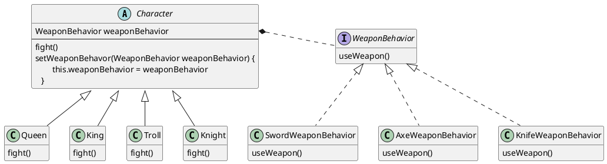
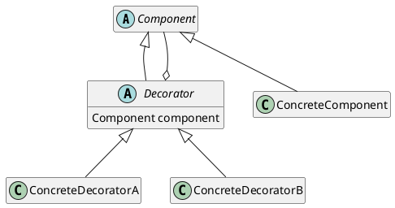
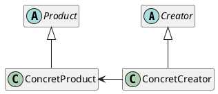
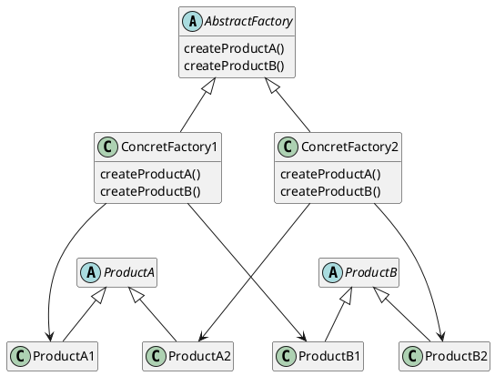
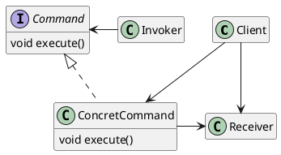
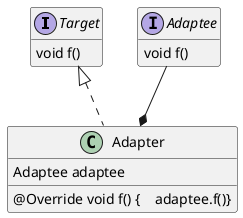
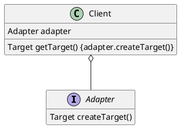

## 1. 设计原则

1. 封装变化。在类设计时，要考虑到可预见的将来中，类的什么部分是会变化的，什么东西是暂时保持不变的，将变化的东西抽取，进行封装。
    > 很重要的一点就是 **可预见的将来**，通常是一到两个 Sprint，因为长远来看，任何东西都是会变化的。

2. 针对接口编程，而不是针对实现编程。好处大家都懂，但是实际怎么做其实不一定能做到。具体怎么做呢？针对接口编程要求我们：
    - 分清「使用者」、「维护者」
    - 「使用者」关注 **接口或者超类**，而不是具体类
    - 「维护者」关注具体类的底层实现

    > 例如，我们要听动物声音，那么 `hearVoice()` 就是动物声音的「使用者」，那么就应该使用 `Animal` 超类而不是 `Dog` 子类

3. 多用组合，少用继承。
    > 注意是 **多用** 和 **少用**，而不是 **只用** 和 **不用**。组合的一个很大的特性就是可以运行时变更，现今的系统也的确需要很大的灵活性，但是对于一些明显是继承关系的也还是需要使用继承来组织

4. 开放-关闭原则
    > 对扩展开放，对修改关闭
    > 也就是说，我们需要做到扩展类的功能，但是不能修改类的代码
    > 注意，如果对所有的类都采用这种方式，是不切实际的，所以仅需要对最有可能变化的部分使用该原则

5. 依赖倒置原则
    > 「依赖」：指的是 A 「使用到」了 B，包括但不限于 **继承**、**实现接口**、**包含**、 **创建实例**
    > 「倒置」：要依赖于 **抽象**，不要依赖于 **具体类**
    > 指导方针：
    > - 变量不能持有具体类的引用，即不使用 `new`
    > - 不要让变量派生自具体类
    > - 不要覆盖基类中已有的方法

## 2. 模式

### 2.1 策略模式

封装类的「行为」（也称为「算法族」），将行为通过接口进行委托，使其能在运行时动态的改变。

要点：
1. 类和行为之间的关系为 **组合**(contains-a)
2. 通过定义算法族，使得不是鸭子的类也能执行鸭子的行为，如鸭子叫
3. 针对算法族的接口编程，如果需要新行为，创建新的行为类实现算法族的接口即可，而不会对原有行为造成影响

附录：组合与聚合

相同点：组合与聚合在代码中的表现都是通过类成员来实现

不同点：

1. 聚合(has-a)，部分和整体之间不存在紧密的依存关系，当整体不存在时，部分依旧可以存在，体现在两者的生命周期可以不同步。
    > 如部门由人员组成，部门撤销，人员依旧保留

2. 组合(contains-a)，部分和整体之间的关系是紧密依存的，当整体不存在时，部分就不存在，体现在两者的生命周期是同步的。
    > 如眼睛和人的关系，当人死去之后，眼睛的生命也就结束了

学以致用：策略模式中，行为和类之间的关系是 **组合**，因为当鸭子的生命结束之后，其行为也就没有了意义。所以它两是紧密的依存关系，两者的生命周期是同步的。

章末练习题：



使用场景：
如果一个类的「行为」是不确定的，那么就可以采用策略模式，使得行为与类进行解耦


### 2.2 观察者模式

在对象之间建立一对多依赖，这样一来，当对象的状态改变，依赖它的所有对象都能得到通知并自动更新。

要点：

1. 一对多，「一」指的是主题(Observable)，「多」指的是观察者(Observer)
2. 「得到通知」的方式有「推」和「拉」
    > 「推」指的是主题直接将状态作为参数进行回调
    > 「拉」指的是将主题本身作为参数进行回调，由观察者调用主题的 getter 获取数据
3. 不要依赖于通知的顺序
    > 指的是观察者和观察者之间的功能，不要依赖于主题通知的顺序，多个观察者之间应该是平行关系


```java
// 推
interface Observer {
  void update(int a, int b, int c);
}
```


```java
// 拉
interface Observer extends Parent {
  void update(Observable observable);
}
```

通常来说，「推」会具有更多的实时性，但是如果新的观察者需要更多的数据，就需要更改所有的观察者；

而「拉」则并没有那么实时，但是「拉」可以取自己需要的通知参数，而不需要主题进行传入，同时，当通知参数需要改变时，不需要大量改变观察者。

### 2.3 装饰者模式

动态地将职责附加到对象上，而不需要修改对象本身。



要点：

1. 装饰者也是产品
2. 装饰者包含产品
    > 1. 2. 可以推出， **装饰者也可以包含装饰者**，这就说明我们可以层层包含无限多的装饰者
3. 装饰者可以在产品的行为前后加入自己的行为， **实现了行为的扩展**
4. 装饰者要求 **针对接口编程**，如果某些代码依赖特定的类，就会导致类型改变等问题
5. 装饰者会导致类数量增加，致使程序复杂


使用场景：当一个类需要从另一个类获得「通知」时，采用观察者模式

### 2.4 工厂模式

定义了创建对象的接口，并将对象的实例化推迟到具体的子类



类型：

1. 简单工厂，只是将创建产品的代码简单封装
2. 工厂方法，`Creator` 定义抽象方法，由子类实现这个方法并生产产品


### 2.5 抽象工厂模式

抽象工厂提供一个接口，用于创建产品家族，而不需要明确指明具体类




要点：

1. 用于构建产品 **家族**
2. 内部通常使用 **工厂方法** 实现
3. 与客户的关系
    > 工厂方法与客户是继承关系
    > 抽象工厂与客户是组合关系

4. 使用上的异同
    > 都是用来 **创建对象**
    > 抽象工厂用来创建产品家族
    > 工厂方法用来创建单个产品
    > 也就是说，如果需要创建产品家族，就使用抽象工厂，而如果只创建单个产品，用工厂方法


总体而言，如果产品的种类确定了，但是产品的风格不同，那么最好就使用抽象工厂。
> 如何理解？比如 `Retrofit` 中，只需要 `RequestConverter` 和 `CallAdapter`，需要的东西是确定的，但是这两个对象却有很多的实现方式，这时候就采用抽象工厂模式

使用场景：
当需要创建对象，而创建的对象种类繁多，或者当前并不明确时，使用工厂模式

### 2.6 单例模式

看另一篇文章，此处略过

使用场景：当对象只需要一个，并要求提供一个全局访问点时使用

### 2.7 命令模式

将「请求」封装成对象，以便使用不同的请求，队列和日志来参数化其他对象，同时也支持撤销操作。

> 「请求」的封装：只暴露请求的执行接口，然后将请求的执行者封入请求对象中，实现封装
> 请求的调用者只知道命令对象能「执行」，但是不需要知道「如何执行」，实现了请求调用者与接收者的解耦




如上图 `Invoker` 只知道抽象的 `Command`，不知道 `Receiver`，符合「依赖倒置原则」

命令模式当然不可能只执行一个 `execute()`，还可以自定义一些其他操作，但是需要注意的是，增加的新操作最好不要有参数，原因在于「执行者」和「接收者」是解耦的，它不知道也不应该知道执行的具体细节，包括传入的参数。

扩展应用：

1. 命令模式的撤销功能
    > 为「命令」加入一个 `undo()`，然后在具体实现中记住上一个状态，或者将 `execute()` 反转
    > 如果需要多次撤销，可以使用一个 **栈**，保存执行的状态
    > 如果还需要还原(`redo()`)，那么就使用另一个栈，撤销时，状态出「撤销栈」入「返回栈」
2. 宏命令功能
    > 执行一个「宏命令」就相当于执行多个命令。
    > 实现上，我们可以用数据结构存储需要执行的多个命令，当 `execute()`，就遍历数据结构，依次执行每个命令的 `execute()`

3. 日志功能
    > 给「命令」增加 `store()` 和 `load()` 功能，当每次执行 `execute()` 的时候都调用 `store()`，当异常出现时，从磁盘中读取已经执行过的命令，并重新执行

### 2.8 适配器模式

将一个「东西」转换成另一个「东西」；
所谓的东西，指的不一定是接口，也有可能是将「数据」转换为「视图」

实现方法1：对象适配器

常用方法



实现方法2：定义方法创建出 `Target`

Android 中 RecyclerView 和 ListView 中使用的方式；
适合于只知道 `Target`，不知道 `Adaptee` 的情况。


