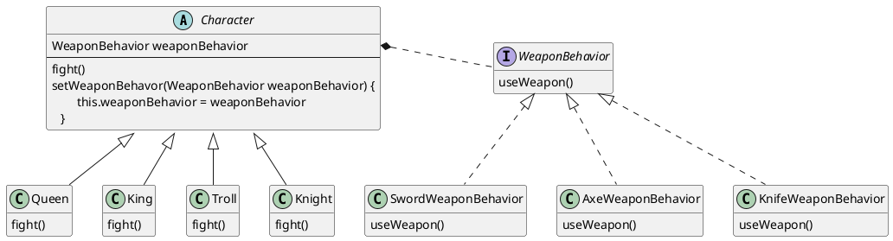

## 1. 设计原则

1. 封装变化。在类设计时，要考虑到可预见的将来中，类的什么部分是会变化的，什么东西是暂时保持不变的，将变化的东西抽取，进行封装。
    > 很重要的一点就是 **可预见的将来**，通常是一到两个 Sprint，因为长远来看，任何东西都是会变化的。

2. 针对接口编程，而不是针对实现编程。好处大家都懂，但是实际怎么做其实不一定能做到。具体怎么做呢？针对接口编程要求我们：
    - 分清「使用者」、「维护者」
    - 「使用者」关注 **接口或者超类**，而不是具体类
    - 「维护者」关注具体类的底层实现

    > 例如，我们要听动物声音，那么 `hearVoice()` 就是动物声音的「使用者」，那么就应该使用 `Animal` 超类而不是 `Dog` 子类

3. 多用组合，少用继承。注意是 **多用** 和 **少用**，而不是 **只用** 和 **不用**。组合的一个很大的特性就是可以运行时变更，现今的系统也的确需要很大的灵活性，但是对于一些明显是继承关系的也还是需要使用继承来组织

## 2. 模式

### 2.1 策略模式

封装类的「行为」（也称为「算法族」），将行为通过接口进行委托，使其能在运行时动态的改变。

要点：
1. 类和行为之间的关系为 **组合**(contains-a)
2. 通过定义算法族，使得不是鸭子的类也能执行鸭子的行为，如鸭子叫
3. 针对算法族的接口编程，如果需要新行为，创建新的行为类实现算法族的接口即可，而不会对原有行为造成影响

附录：组合与聚合

相同点：组合与聚合在代码中的表现都是通过类成员来实现

不同点：

1. 聚合(has-a)，部分和整体之间不存在紧密的依存关系，当整体不存在时，部分依旧可以存在，体现在两者的生命周期可以不同步。
    > 如部门由人员组成，部门撤销，人员依旧保留

2. 组合(contains-a)，部分和整体之间的关系是紧密依存的，当整体不存在时，部分就不存在，体现在两者的生命周期是同步的。
    > 如眼睛和人的关系，当人死去之后，眼睛的生命也就结束了

学以致用：策略模式中，行为和类之间的关系是 **组合**，因为当鸭子的生命结束之后，其行为也就没有了意义。所以它两是紧密的依存关系，两者的生命周期是同步的。

章末练习题：

### 2.2
