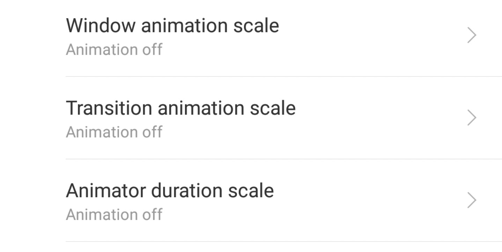

最近在迁移到 AndroidX 之后一直折腾 TDD 的事情，也遇到了大的小的不少坑点；

鉴于 AndroidX 在测试方面还没有太多的文档，就写一篇博文来总结一下折腾的经验，也给后来人做一些参考。

<!-- more -->

## 1. 国产 ROM 的坑

`ActivityScenario` 和 `ActivityScenarioRule` 是新推出的操作 Activity 生命周期的类。

当构建 `ActivityScenario` 时，它便会自动启动你指定的 Activity 并让它处于 `RESUMED` 状态。

使用示例如下：

```kotlin
@RunWith(AndroidJunit4::class)
class MainActivityTest {
  @get:Rule
  val mainActivityScenarioRule = ActivityScenarioRule<MainActivity>(MainActivity::class.java)

    @Test
    fun onCreate_saveInstanceNull() {
        mainActivityScenarioRule.scenario
                .onActivity { activity ->
                  // 在这里获取 Activity 实例
                }
    }
}
```

但是，当我在手机上跑这个测试的时候，却遇到了下面的问题：

```bash
java.lang.AssertionError: Activity never becomes requested state "[RESUMED]"
(last lifecycle transition = "PRE_ON_CREATE")
```

也就是说，我这个 Activity 实际上并没有真正的 `onCreate` 而是一直处于被创建之前的状态，随后因为超时导致了报错退出。

> 具体的超时时间是 45 秒

但是到底是什么东西导致我的 Activity 启动不了却没有什么头绪，直到我用模拟器运行测试代码的时候，我发现： **居然测试通过了！**

原来，Android 的仪器测试(Instrumented Test)都会构建一个独立的 `test.apk` 并自动安装和运行。

而国产的手机系统对于应用自启动的管理非常激进（例如华为），而我也没有对 `test.apk` 设置白名单，于是系统就一直禁止 `tesk.apk` 的启动，导致测试失败。

在华为的手机应用管家中为 `test.apk` 设置白名单，测试就可以通过了。

## 2. Fragment Testing 的坑


### 2.1 编译依赖的坑

和 ActivityScenario 一样，Google 也提供了一个 FragmentScenario 方便在测试中获取 Fragment 实例和对 Fragment 进行操作。

但是需要引入 `fragment-testing` 库，按照 Google 的文档是下面的这条语句:

```groovy
debugImplementation 'androidx.fragment:fragment-testing:1.1.0-alpha07'
```

这里就是它的第一个坑，如果你只引入上面的这条语句，实际上根本不可能成功 Build。

主要有以下两点原因：

1. `fragment-testing` 需要依赖 `androidx.test.core`，而 debugImplementation 并没有引入 `androidx.text.core`

2. 我们需要在 Instrumented Test 中使用 `fragment-testing`，而上面并没有在 `androidTestImplementation` 引入


于是乎，正确的引入方式是：

```groovy
debugImplementation(Libs.androidx_test_core)
debugImplementation(Libs.fragment_testing)
androidTestImplementation(Libs.androidx_test_core)
androidTestImplementation(Libs.fragment_testing)
```

那么能不能把 `debugImplementation` 换成普通的 `implementation` 呢？

很可惜，这是不行的，不过至于为什么不行，我目前并没有对此进行深入研究。


### 2.2 主题的坑

导入和依赖的坑解决之后就到了如何使用的环节了。

具体的用法为：

```kotlin
@Test
fun testFragment() {
  launchFragmentScenario<LoginFragment>() { fragment ->
    // 使用 fragment
  }
}
```

但是，这么使用也是不行的。

如果你使用了 Material 的组件，例如 `TextInputLayout`，那么它会报如下错误：

```
Caused by: android.view.InflateException: Binary XML file line
#9: Error inflating class
**com.google.android.material.textfield.TextInputLayout**
```

在查阅相关资料之后，发现了[一个相关的 Issue](https://issuetracker.google.com/issues/119054431)

其中 Google 的人指出：

> You need to tell FragmentScenario **what theme you want** if you want something **other than the default Theme.WithActionBar**, that's correct.

也就是说，如果你使用了 Material 相关的主题，比如说常见的 `Theme.Appcompat` 等，那么就需要向 `FragmentScenario` 明确指出你使用的主题样式。

也就是说，上面的代码需要写成：

```kotlin
fun testFragment() {
  launchFragmentScenario<LoginFragment>(
    themeResId = R.style.Your_App_Theme
    ) { fragment ->
    // 使用 fragment
  }
}
```

程序才能正常运行。

## 3. 动画的坑

Android 官方的 Espresso 测试框架不能兼容动画效果，在跑测试，特别是点击、输入等 UI 测试时，需要进入开发者模式把能显示动画的都关掉：



不然 Espresso 会报 `PerformException`。

## 4. 测试 ImageView 的 Drawable 的坑

对于 `ImageView`，我们需要测试它是否展示出了我们传入的 Drawable，
