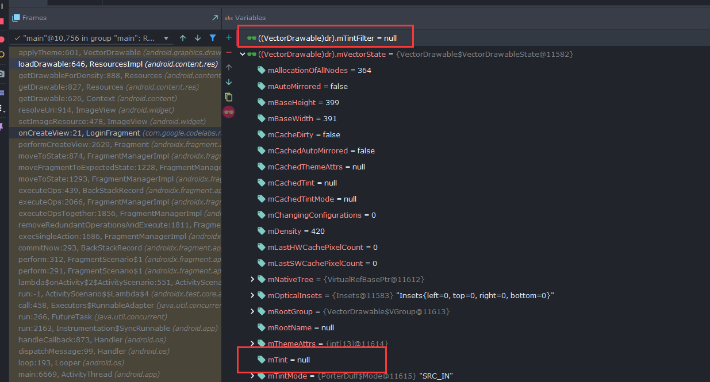
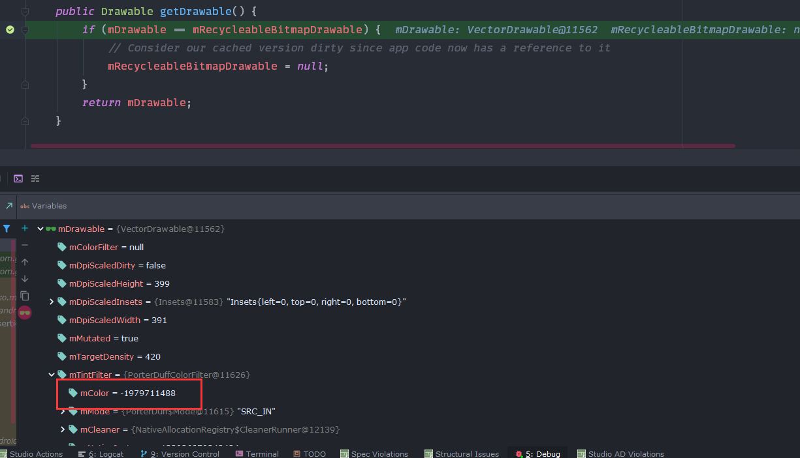
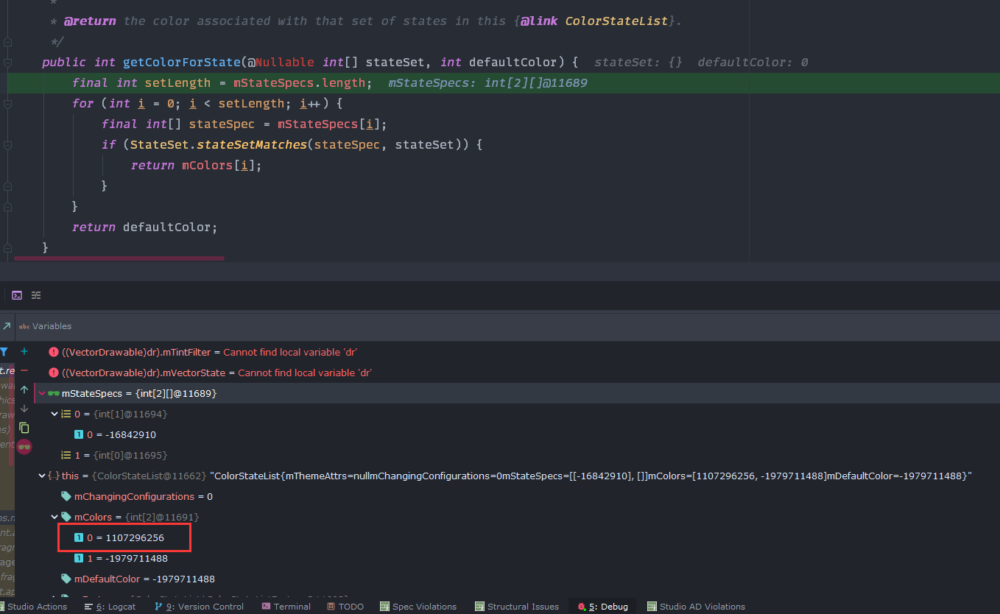
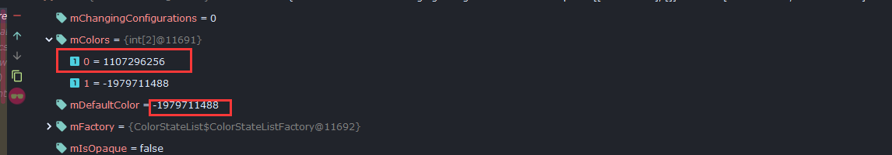

[上篇文章](/Android/android-测试坑点详解（一）/)我们说到如果你的 VectorDrawable 如果采用一个带 `<selector>` 的颜色进行着色，那么就需要在测试代码中对 Drawable 进行重新着色，而不是直接比较。

本篇文章就来着重说说其中的原理。

<!-- more -->

## 1. 测试 Drawable 的主要流程

首先，我们来看看整个测试程序经历的流程，自顶向下才能更好的把握是什么地方什么阶段出现了问题。

运行 Drawable 的测试的过程大体如下：

1. `ImageView` 将 Drawable 在界面中展示
2. `TestRunner` 从 Context 中获取期望值
3. 将两者进行比较

接下来，我们就分步来看具体流程，最后来定位到底是什么地方出现了问题。

## 2. ImageView 展示 Drawable 的流程

在测试中，我们采用 `imageView.setImageResource()` 的方法来展示 Drawable，由于代码比较长，就不贴出全部代码了，仅仅对流程和某些关键语句和行进行介绍。

首先，`ImageView` 会将原先的 Drawable 置为空，然后在 `resolveUri()` 方法中，会对我们传入的资源 ID 进行解析，然后通过 `Context` 获取这个 Drawable：

```kotlin
Drawable d = null;
if (mResource != 0) {
  try {
    d = mContext.getDrawable(mResource);
    ...
```

获取到 Drawable 之后，`ImageView` 就会调用 `updateDrawable()` 更新自身的 Drawable：

```kotlin
private void updateDrawable(Drawable d) {
    if (d != mRecycleableBitmapDrawable && mRecycleableBitmapDrawable != null) {
        mRecycleableBitmapDrawable.setBitmap(null);
    }

    boolean sameDrawable = false;

    if (mDrawable != null) {
       sameDrawable = mDrawable == d;
       mDrawable.setCallback(null);
       unscheduleDrawable(mDrawable);
       if (!sCompatDrawableVisibilityDispatch && !sameDrawable && isAttachedToWindow()) {
         mDrawable.setVisible(false, false);
       }
     }
     mDrawable = d;

     if (d != null) {
       d.setCallback(this);
       d.setLayoutDirection(getLayoutDirection());
       if (d.isStateful()) {
         d.setState(getDrawableState());
       }
       ...
```

其中，比较重要的是 `d.setState()`，正是它根据当前 `ImageView` 所处的状态（State）来对其 Drawable 进行着色的。

那么，我们看到，实际上 `ImageView` 在展示 Drawable 的时候，实际上大体上分成了两个步骤：

1. 通过 `Context` 获取 Drawable 实例
2. 根据 `ImageView` 所处状态和相应属性对获取得到的 Drawable 做出相应改变
3. 展示

所以问题是不是出现在 `Context` 获取 Drawable 的时候呢？我们来继续看看 Context 获取 Drawable 的过程。

## 3. Context 获取 Drawable 的过程

所有的测试，实际上都是拿期望值和实际结果进行比较，而对于 Drawable 来说，期望值实际上就是我们本地存储的 Drawable，而获取这个期望值实际上还是通过 Context 来获取得到的。

要想深入了解这个问题的成因，我们就要首先看看 Context 获取 Drawable 的过程。

首先，`Context` 调用 `getDrawable()` 最终会调用到 `ResourceImpl` 的 `loadDrawable()` 方法，这个方法的流程大致如下：

1. 查找 Drawable 缓存
2. 若缓存命中，则直接返回缓存值
3. 若未命中，则创建 Drawable
4. 使用传入的 `theme` 对新创建的 Drawable 进行相关调整（如着色等）
5. 将 Drawable 写入缓存
6. 返回

这个流程本身没什么问题，但是在经过 `applyTheme()` 方法之后，我们发现此时的 Drawable 出现了变化：

在 `applyTheme()` 之前，Drawable 的 `mTintFilter` 和 `mVectorState` 中的 `mTint` 都是空的：



而在经过 `applyTheme()` 之后，Drawable 的 `mTintFilter` 和 `mVectorState` 中的 `mTint` 都被赋上了值：


其中更重要的一点就是这个 `mColor` 值和我们后面从 `ImageView` 的 Drawable 中得到的 `mColor` 并不一样：



进一步的分析可以看到，在 `mVectorState` 中的 `mTint` 实际上保留了两个 `mColor` 值，其中一个是 `Context` 获取的 Drawable 的 `mColor`，另一个则是在 `ImageView` 中获取到的 `mColor`。

所以说，极有可能是在 `applyTheme()` 方法中出现了什么问题，导致其赋予 Drawable 一个错误的 `mTint` 从而导致 BUG 的出现。

## 4. 深入 applyTheme 方法

在上面的分析中，我们知道，在 `applyTheme()` 方法中，系统会赋予 Drawable 一个着色，但是这个着色是有问题的，那么我们只要找到哪条代码会导致着色变化即可。

经过不断的步进，我终于找到了对着色进行更改的方法——`updateLocalState()` 方法：

```java
private void updateLocalState(Resources res) {
  final int density = Drawable.resolveDensity(res, mVectorState.mDensity);
  if (mTargetDensity != density) {
    mTargetDensity = density;
    mDpiScaledDirty = true;
  }

  mTintFilter = updateTintFilter(mTintFilter, mVectorState.mTint, mVectorState.mTintMode);
}
```

我们可以看到，这个方法最后会调用 `updateTintFilter()` 使用 `mVectorState` 中的着色值对 Drawable 进行着色，而这个着色值正是我们在上面看到的那个具有两个 Int 的数组，包含了两种不同的颜色。

深入进去，我们可以发现：

```java
@Nullable PorterDuffColorFilter updateTintFilter(@Nullable PorterDuffColorFilter tintFilter,
        @Nullable ColorStateList tint, @Nullable PorterDuff.Mode tintMode) {
    if (tint == null || tintMode == null) {
        return null;
    }

    final int color = tint.getColorForState(getState(), Color.TRANSPARENT);
    if (tintFilter == null) {
        return new PorterDuffColorFilter(color, tintMode);
    }

    tintFilter.setColor(color);
    tintFilter.setMode(tintMode);
    return tintFilter;
}
```

实际上，这个方法是通过 Drawable 的 State 在 `mVectorState.mTint` 中获取对应的颜色，然后对 `mTintFilter` 进行赋值的。

到这里，关键点就来了，由于我们是第一次通过 `Context` 获取 Drawable，此时，Drawable 还不具备状态，那么 `getState()` 的结果实际上是一个 **空数组！**

我们紧接着看 `getColorForState()` 方法：

```java
public int getColorForState(@Nullable int[] stateSet, int defaultColor) {
  final int setLength = mStateSpecs.length;
  for (int i = 0; i < setLength; i++) {
    final int[] stateSpec = mStateSpecs[i];
    if (StateSet.stateSetMatches(stateSpec, stateSet)) {
      return mColors[i];
    }
  }
  return defaultColor;
}
```

经过调试结果，我们可以看到：



这里面的 `mColor` 正是 `mVectorState.mTint` 的两个值，并且，第一个就是 Context Drawable 的 `mTint` 值。

那么也就说明：`stateSetMatches()` 方法第一次就通过了。

所以，问题应该就是出在 `stateSetMatches()` 方法中。

## 5. stateSetMatches 方法流程

这里先上一个调试结果：


从调试中我们可以看到，`stateSpec` 有一个负数值，而 `stateSet` 是空的。

下面是这个方法的部分源码：

```java
public static boolean stateSetMatches(int[] stateSpec, int[] stateSet) {
     if (stateSet == null) {
         return (stateSpec == null || isWildCard(stateSpec));
     }
     int stateSpecSize = stateSpec.length;
     int stateSetSize = stateSet.length;
     for (int i = 0; i < stateSpecSize; i++) {
         int stateSpecState = stateSpec[i];
         if (stateSpecState == 0) {
             // We've reached the end of the cases to match against.
             return true;
         }
         final boolean mustMatch;
         if (stateSpecState > 0) {
             mustMatch = true;
         } else {
             // We use negative values to indicate must-NOT-match states.
             mustMatch = false;
             stateSpecState = -stateSpecState;
         }
         boolean found = false;
         for (int j = 0; j < stateSetSize; j++) {
           ...
         }
         if (mustMatch && !found) {
             // We've reached the end of states to match and we didn't
             // find a must-match state.
             return false;
         }
     }
     return true;
 }
```

从中我们可以看到，实际上这个函数就是对比状态是否相等，由于我们的 `stateSet` 是空数组，所以就隐去了其相关的 `for` 循环部分，因为这个循环实际上是会被跳过的。

从外部的 `for` 循环中来看，我们发现由于 `stateSpecState` 是一个负数，所以 `mustMatch` 为 `false`，而由于我们又没有找到相应的符合规范的状态，因此 `found` 也是 `false`。

此时，外层的第一次也是唯一一次的 `for` 循环就结束了，那么循环跳出，**最后返回 true！**


也就是说，当 Drawable 没有状态时，系统会默认其 **符合任何状态！**

于是，`mColors` 的第一个颜色值会被返回，但实际上它并不是 `ColorStateList` 的默认值：



而由于 `ImageView` 会在拿到 Drawable 之后通过其状态来更新着色，因此就会导致着色的不相同。

## 6. 案件重现

到这里，问题的成因就已经水落石出了，侦探推理完成后都会进行一下案件重演，那么在这里也重新回顾一下整个流程和问题的原因：

1. ImageView 展示 Drawable 调用了 `Context`
2. `Context` 第一次创建 Drawable 并不带有状态
3. 空状态导致系统着色判断错误
4. `Context` 随即将错误的着色 Drawable 进行缓存
5. `ImageView` 获取到 Drawable 之后根据其状态给予了正确的着色
6. 测试程序再次通过 `Context` 获取 Drawable 由于缓存命中，返回了错误着色的 Drawable
7. 由于测试程序获取的期望值和 `ImageView` 的真实值不相同，因此测试报错不通过

其中，我们看到，问题的关键在于系统在 Drawable 初次创建完成时错误判断了其着色颜色，从而返回颜色列表的第一个值而忽略其真正的默认值。

由于我们再次通过 `Context` 取 Drawable 会因为缓存而拿到错误着色的 Drawable，所以我们需要对拿到的 Drawable 根据运行环境进行重新着色。

但是如果你的 `<selector>` 的第一个 `<item>` 就是默认的话，那么就没有这个问题，不需要重新着色了。


## 7. 附：默认的 colorControlNormal 值

在调试之余我还翻了一下默认的 `colorControlNormal` 值，结果是根据你设定的根主题的不同，可能会有下面的两个值：

1. `?android:attr/textColorPrimary`
2. `?android:attr/textColorSecondary`

但无一例外它们都是 `<selector>`，而且有状态的颜色值处在第一个。

```xml
<!-- textColorPrimary -->
<selector xmlns:android="http://schemas.android.com/apk/res/android">
    <item android:state_enabled="false"
        android:alpha="?attr/disabledAlpha"
        android:color="?attr/colorForeground"/>
    <item android:alpha="?attr/primaryContentAlpha"
        android:color="?attr/colorForeground"/>
</selector>
```

```xml
<!-- textColorSecondary -->
<selector xmlns:android="http://schemas.android.com/apk/res/android">
    <item android:state_enabled="false"
        android:alpha="?attr/disabledAlpha"
        android:color="?attr/colorForeground"/>
    <item android:alpha="?attr/secondaryContentAlpha"
        android:color="?attr/colorForeground"/>
</selector>
```
