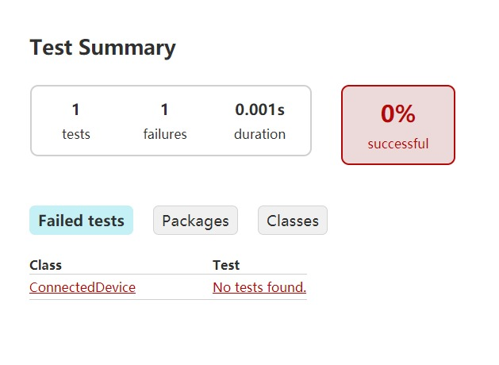
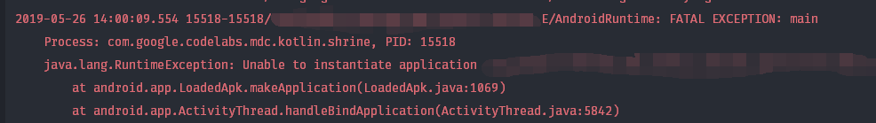
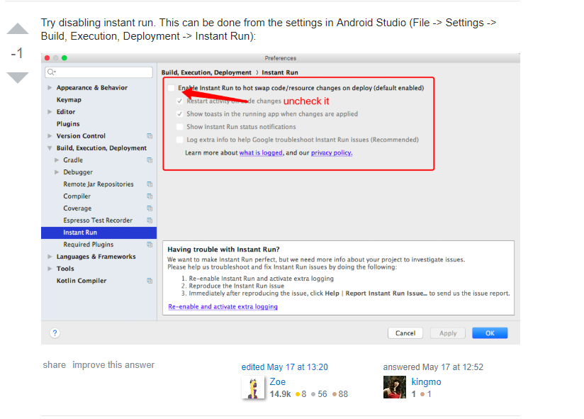

之前又稍微折腾着想尝试一下 TDD，并在每次构建的时候加入测试环节，当测试不通过就不允许 build。

当一切都配置好，点下 build App 的时候，却出现了 `There were failing tests.`。

我心想，不会啊，现在我就根本没写几个测试用例，为什么会通不过？

于是，就开始了艰难的调试过程

<!-- more -->

## 0. 更新

2019-05-27 更新： Google 回复：Instant Run 在新版本已经不被支持了，他们开发了一个更好的功能叫 Apply Change。


> Instant Run has been deprecated in Android Studio 3.5 and instead we've implemented a brand new solution called Apply Changes that is more stable and doesn't modify your APK on build.
> ...
> We recommend **turning off Instant Run** in the settings for earlier versions of Android Studio


所以还在使用 3.4 稳定版的，直接把 Instant Run 关掉吧。

## 1. ConnectedDevice No tests found

打开测试结果，就得到了下面这张图



再点进去一看：


它说我没有按照 JUnit 的方式编写测试用例，但是我的测试用例都是加了 `@Test` 的啊

```kotlin
@RunWith(AndroidJUnit4::class)
class ApplicationTest {
    @Test
    fun useAppContext() {
        // Context of the app under test.
        val appContext = InstrumentationRegistry.getInstrumentation().targetContext

        assertEquals("aaa.bbb.ccc.ddd", appContext.packageName)
    }
}
```

于是就陷入了困境，问题到这里就消失了，到底应该怎样才能定位到问题呢？

## 2. 使用 gradle 命令行进行构建尝试

Android Studio 的 Run App 实际上就是先执行 `assemble[Build-Variant]` 然后再将生成的 apk 安装到手机的过程。

而这个 `assemble` 实际上是通过 `gradle` 执行的，于是可以尝试通过 gradle 命令行进行编译，看看是不是 gradle 导致的问题。

然而，gradle 单独进行编译并没有这个问题：


所以很有可能是 Android Studio 自身的构建出现了问题，但是，目前的构建信息并不足以让我们定位到问题，所以需要获取更多的构建信息。

## 3. INSTRUMENT: Process Crashed

首先，我们在 `Build, Execution, Deployment -> Compiler` 开启 `gradle --scan`


然后，点击红框里面的小图标让 Build 信息变成文字：


之后，就看到了 build 失败的详细信息了：


原来是在测试的时候程序崩溃了，这才导致了测试的失败。

经过一番 StackOverflow 之后，[这个答案](https://stackoverflow.com/a/21611370) 提醒了我：


由于 Instrument Test 实际上是安装了一个 `test.apk`，所以它的报错信息会在 Log Cat 而不是 Build Output 中。

## 4. Didn't find class CoreComponentFactory

打开 Log Cat，首先映入眼帘的是 `Unable to instantiate application`



原来在执行测试的时候，没有办法实例化 `Application` 导致 Instrument Test 无法找到 `Context`，于是程序就崩溃导致测试失败了。

再往上看，可以看到导致无法实例化 `Application` 的原因：


原来是构建 `Application` 的工厂找不到了，从而造成它无法实例化。

## 5. 罪魁祸首 Instant Run

`Didn't find class CoreComponentFactory` 这个问题之前也遇到过，是因为 R8 将其混淆了，导致在 release 模式下找不到这个类，但是现在是 debug 模式，并没有启用混淆，但是依然还是找不到这个类。

在经过又一阵子的 StackOverflow 之后，我找到了[这么一个答案](https://stackoverflow.com/a/56186821)：



虽然它被减成了负分，但是也不妨碍我尝试一下它的可用性。

于是我将 Instant Run 取消掉，奇迹发生了，程序竟然就编译通过并成功安装在了模拟器上。


## 6. 总结

到这里，整个调试过程就结束了，也给 Google 提了这个 bug。

虽然不敢肯定一定是 Instant Run 的问题，但是目前（AS 3.4.1）来看，取消 Instant Run 就可以运行成功。

这个问题本身可能有一些特异性，不过倒是从中学到了一个知识：

类似的 Instrument Test 的失败最好先去 Log Cat 寻找原因。

也希望大家能从这篇博客中能学到一些什么吧。
