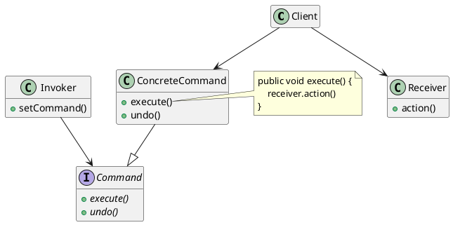

## 1. 概述

命令模式将『请求』封装成对象，以便使用不同的请求，队列或者日志系统。

命令模式也可以支持可撤销和回滚操作。

命令模式通过将请求进行封装，成功地将客户和具体的低层组件进行解耦；

客户只需要知道要加载命令，而不需要知道如何进行命令的具体执行操作。


<!-- more -->

## 2. 类图结构



 可以看到，`Client`  处于最高层，它不需要知道 `Command` 的执行过程；

 这就达到了客户和低层组件的解耦目的。


## 3. 封装请求调用者

一个很重要的地方就是我们的请求接收者 `Receiver` 和我们的命令对象 `Command` 是组合关系

也就是说，`Command` 具有一个接收者的内部对象；

否则，它无法真正地成为一个可以执行的命令。

```java
public interface Command {
    void execute();
    void undo();
}

public class ConcreteCommand implements Command {

    private Receiver receiver;

    public ConcreteCommand(Receiver receiver) {
        this.receiver = receiver;
    }

    @Override
    public void execute() {
        receiver.action();
    }
}
```


<!-- more -->

## 4. 支持撤销和回滚

通常的命令都会具有可撤销的属性要求；

那么我们如何实现这个可撤销的需求呢？

撤销实际上就是返回到命令执行前的一个状态中；

所以在实际的命令对象类中，我们通过记住 **上一个** 命令时的状态，就能实现撤销功能。

```java
public class CeilingFanHighCommand implements Command {
    CeilingFan ceilingFan;
    int prevSpeed;  // 前一个命令后风扇的转速

    public CeilingFanHighCommand(CeilingFan ceilingFan) {
        this.ceilingFan = ceilingFan;
    }

    public void execute() {
        prevSpeed = ceilingFan.getSpeed();
    }

    public void undo() {
        if (prevSpeed == CeilingFan.HIGH) {
            ceilingFan.high();
        }
        else if (prevSpeed == CeilingFan.MEDIUM) {
            ceilingFan.medium();
        }
        else if (prevSpeed == CeilingFan.LOW) {
            ceilingFan.low();
        }
        else if (prevSpeed == CeilingFan.OFF) {
            ceilingFan.off();
        }
    }
}
```

## 5. 使用空对象替代 `null`

对于命令模式来说，它的客户类还是有一些细微的要求；

我们可以使用一个队列或者数组来代表需要执行的命令插槽；

当插槽没有加载命令时候，我们普通的做法是使用一个 `null` 来进行替代；

但是，此时我们就需要对命令对象进行空检测：

```java
public void onButtonWasPushed(int slot) {
    if (onCommand[slot] != null) {
        onCommand[slot].execute();
    }
}
```

对此，我们可以使用一个 `NoCommand` 对象，它是一个命令对象，只不过什么都不做；

这样，即使插槽没有加载命令，我们也可以直接使用 `NoCommand` 来替代，这样就不需要进行空检测了：

```java
Command noCommand = new NoCommand();

for (int i = 0; i < 7; i++) {
    onCommands[i] = noCommand;
    offCommands[i] = noCommand;
}
```

## 6. 宏命令

命令模式的一个最大的优点就是能使用宏命令；

也就是一次调用，执行多个命令；

实际上，我们只需要将命令对象中包装的接收者变成命令对象数组即可：

```java
public clas MacroCommand implements Command {
    Command[] commands;

    public MacroCommand(Command[] commands) {
        this.commands = commands;
    }

    public void execute() {
        for (int i = 0; i < commands.length; i++) {
            commands[i].execute();
        }
    }
}
```

## 7. 队列请求

除此之外，命令模式还可以使用于工作队列；

也就是说我们可以构建一个接受命令对象的队列，它只是按照顺序进行命令的执行操作；

当线程可用时，它就会将命令分配给线程，然后执行 `execute()`；

队列并不需要关心命令究竟是什么，是如何完成的，只需要对命令进行调度即可。


## 8. 日志和恢复

除了队列以外，我们另一个应用范围就是日志系统和崩溃恢复；

为了完成这个功能，我们可以在命令接口中添加 `store()` 和 `load()` 方法；

当调用者调用命令时候，同时调用 `store()` 将命令对象序列化到服务器中进行存储；

当崩溃发生，需要恢复时，我们就可以将存储服务器中的命令对象进行反序列化，然后调用 `load()` 方法；

## 9. 优缺点

命令模式的优点非常明显，就是可以完全实现客户类和低层组件的解耦；

高层的调用者不需要知道命令执行的具体细节，只需要调用接口的方法就可以执行命令的调用。

但是缺点是它需要创建不同的命令对象来进行不同的命令接收者的包装；

这就会让我们的代码中出现很多的小型类。
