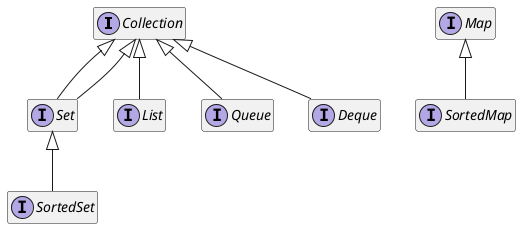

## 1. 介绍

任何语言都会提供一套基础的数据结构的库；

Java 也不例外，而且提供了一个庞大的数据结构库，有时对于它们之间的选择让人很困惑。

这里就来简单说明一下 Java 的 Collection 和基本的 Collection 数据结构


<!-- more -->

## 2. 接口关系图

和现代的数据结构类库一样，Java 采用了 Collection 接口和实现相分离的策略。

通过这样，来做到使用一个统一的接口，对某种数据结构的不同实现进行多态调用。

基本的 `Collection` 接口继承关系如下：



需要注意的是，`Map` 并非 `Collection` 的子类，而是自成一派。

同时，这些接口都是 **泛型接口**，可以使用它们定义泛型方法。

## 3. 接口具体含义

这些接口的具体含义如下：

- `Collection`

    >  Collection 类结构的根，一个 Collection 代表了一堆对象的集合体，对象通常被称作 _元素_

- `Set`

    > 一个 **不能拥有重复元素** 的 Collection，类似数学意义上的集合

- `List`

    > 一个 **有序的**  Collection，有时也被称作 **序列**(sequence)
    > 一般来说，`List` 的用户对于 `List` 有着比较精确地控制
    > 用户可以使用索引来进行元素的查找和插入操作

- `Queue`

    > 一个存储着即将进行处理的元素的 Collection
    > 相比 Collection，它提供了特别的加入、删除和查找操作
    >
    > 比较特别的是，队列一般来说具有 **先进先出**(FIFO) 的插入和删除次序
    > 队列的新元素位于队列末尾，旧元素位于队列头部

- `Deque`

    > 双端队列，在队列两头都可以进行插入和删除操作
    > 同时，双端队列也同时支持 **先进先出**(FIFO) 和 **后进先出**(LIFO) 的插入和删除策略

- `Map`

    > 一个存储键值对的对象
    > `Map` 不能包含重复键，每个键可以被映射到最多一个值上

- `SortedSet`

    > 一个它的元素按照 **升序排列** 的 `Set`

- `SortedMap`

    > 一个它的键按照 **升序排列** 的 `Map`


<!-- more -->

## 4. Abstract 类

集合框架中，除了接口和具体实现，还提供了一系列的 `Abstract*`  类；

它是 `Collection` 和 `Map` 以及其子接口的简单实现形式，利用泛型来提供了一些通用的方法；

比如 `contains()` 方法，就是利用了泛型的 `Iterator` 实现的。

`Abstract` 类是用于进行具体集合类实现的，通过继承 `Abstract` 类，可以极大减轻

## 5. 视图

在通常情况下，我们需要将一个具体的 `Collection` 或者 `Map` 对象转换成另一种集合框架内的具体对象进行操作；

所以，集合框架提供了一种很有用的视图技术；

视图(views) 指的就是返回一个实现了 **其他接口** 的 **引用**，通过这个引用，来进行 **原有集合** 的操作，这个对象引用就是视图。

## 5.1 `Array.asList()`

不仅集合框架中存在包装器，`Array` 类中也存在可以包装成一个 `List` 的方法；

它返回一个 `List` 的视图，可以通过它来使用 `List` 中的访问方法（包括 `get` 和 `set`）对 **原数组** 进行访问和元素的修改；

但是，不能调用 `add()` 和 `remove()` 这种能够对数组大小产生影响的方法；

注意，视图对象始终是在 **原对象** 进行操作的。

> 有趣的是，`asList()` 返回的也是 `ArrayList` 对象
> 不过，不是 `java.util.ArrayList`，而是 `java.util.Arrays.ArrayList`，是其自身的一个子类

Java 5 之后，`asList()` 方法声明为了不定参数，可以直接传入元素进行转换操作。

## 5.2 子范围

可以使用诸如 `subXXX()` 和 `headXXX()` 和 `tailXXX()` 方法返回 Collection 的一个子范围；

可以通过这个子范围视图对集合的一部分进行操作。

## 5.3 不可变的视图

通过 `unmodifiableXXX()` 可以获取一个不可修改的视图；

这个视图中的所有的更改器方法都会返回 `UnsupportedOperationException`；

当然，这不意味着其原始集合不能被更改，只是视图对象不能更改原有集合，但是通过原始集合的引用，同样可以更改原始的集合。

需要注意的是，`unmodifiableCollection()` 返回的集合是通过原始的 `Object.equals()`  方法进行相等性判断的；

也就是说，不能通过 `Collection` 视图进行相等性判定。

## 5.4 同步视图

集合框架还提供了一个同步视图，用来进行一系列的多线程同步工作。

通过 `synchronizedXXX()` 可以获取到一个线程安全的 `Collection` 或者 `Map`；

不过，这个线程安全仅限于一些基本的方法；

对于遍历方法，包括使用迭代器和 `Stream`，都需要 **手动进行同步**

## 5.5 检查视图

在 Java 5 引入泛型之后，集合框架提供了一个检查视图；

它专门用于检查是否有其他类型的对象混入了集合之中。

例如：

```java
ArrayList<String> strings = new ArrayList<>();
ArrayList a = strings;
a.add(new Date());
```

由于使用了原始类型，编译器无法发现这一泛型错误。

使用检查视图，我们就可以发现这一错误：

```java
List<String> checkedStrings = Colllections.checkedList(strings, String.class);
```

当发现类型不符合时，它会立即抛出一个 `ClassCastException`；

不过，它也有缺陷，它是依赖于虚拟机的泛型安全机制；

当向 `ArrayList<Pair<String>>` 中插入 `Pair<Date>` 时，就不能检测出这种错误。
