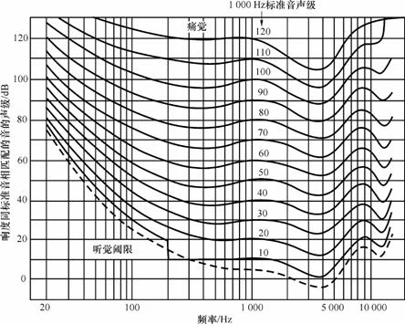
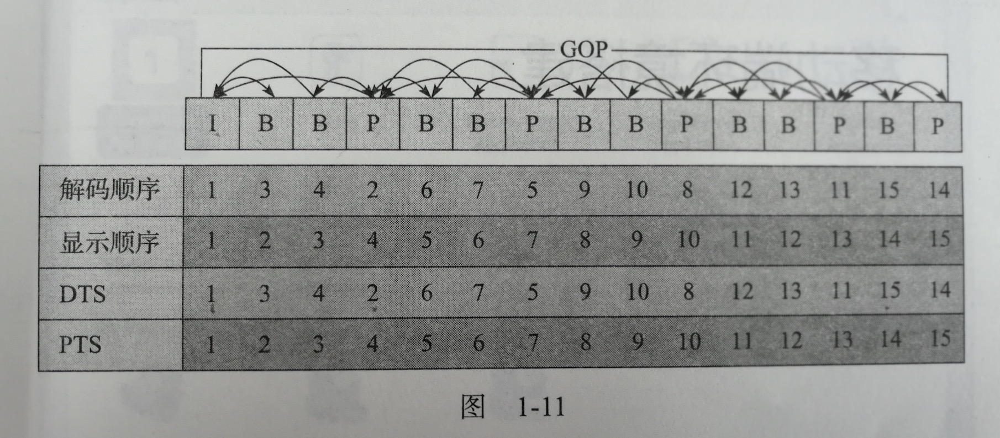

最近准备入门音视频开发，就学习内容做一下笔记吧

<!-- more -->

## 1. 声音的物理相关概念

声音是纵波，是由波源振动产生的，声波在介质中传播，是通过波源振动引起介质分子的周期性振动进行的

### 1.1 声音相关 n 要素解析

- 声波三要素
  1. 频率
  2. 振幅
  3. 波形
- 语音四要素
  1. 音高
  2. 音强
  3. 音长
  4. 音色
- 声音三要素
  1. 音调
  2. 响度
  3. 音色

几要素之间的关系：

```
频率 <-> 音高 = 音调
振幅 <-> 音强 <-> 响度
波形 <-> 音色
```

具体来说，声音的音高就是音调，与声波的频率相关
声音的音强和响度相关，两者和声波的振幅有关
声音的音色与声波的波形相关，但也和其他要素有关

音长是一个音的持续时间长短，在语音学等有研究意义，但不属于声音的物理性质

下面对几个概念进行解析

#### 1.1.1 音调与频率

音调或者音高是衡量人类心理对标准音高的感受，通常使用字母和升降调符号（如 `A#`）来对音高进行标记，和声波的频率相关。

标准音高记为 $A$，其频率为 **440Hz**

事实上，根据不同的标准可以列出频率和音调之间的函数关系，如广为使用的 MIDI 标准规定了一个线性的音高空间，其函数表达式为：

$$
p = 69 + 12\times\log_2 { \left(\frac {f}{440} \right) }
$$

其中，标准音高 $A = 69$

与音调相关的常见概念还有：

1. 音阶：按照音高排列的一系列音符，有多种组合方式，例如常见的 Do-Re-Mi 就是七声音阶
2. 音程：两个音的音高之间的相对关系，在频率上表现为两个音的频率差距，通过调律系统确定，目前最常用的为十二平均律
3. 八度：音程的一种，指的是两个音的频率关系为 **2:1**
4. 半音：采用十二平均律的一种音程划分，一个八度分为十二个半音，半音之间的频率**比值**为： ${\displaystyle \,{\sqrt[{12}]{2}}=2^{\frac {1}{12}}\approx \,} {\displaystyle 1.0594630943593} {\displaystyle 1.0594630943593}$
5. 全音：两个半音的距离为一个全音


#### 1.1.2 音强、声压和响度

音强、声压响度都与声波的振幅相关，都是描述声音能量大小的一个度量，其中：

音强又称声强，是**客观量**，定义为单位面积的声音功率，单位为 $\mathrm{W/m^2}$

声压也是**客观量**，是指声波通过介质时，由振动产生的**压强改变量**，单位为帕斯卡($Pa$)

响度是**主观量**，指的是人类感觉声音大小的知觉量，响度不仅和音强有关，也和**频率**有关

##### 1.1.2.1 音强和声压

音强和声压具有换算关系，设 $I$ 为声强，$p$为声压，$v$为声音在介质中的速度，则：

$$
I = p \cdot v
$$

> 上面的计算式可以通过单位制运算进行验证：
> $$
> \begin{aligned}
> Pa &= N / m^2 \\
> v &= m/s \\
> \therefore I_1 &= \frac{N}{m^2} \cdot \frac{m}{s} \\
> &= \frac{N}{ms} \\
> \because I &= W/m^2 \\
> P &= F \cdot v \\
> &= N \cdot m/s \\
> &= W \\
> \therefore I_2 &= \frac{W}{m^2} \\
> &= \frac{N \cdot m/s}{m^2} \\
> &= \frac{N}{ms} \\
> \because I_1 &= I_2 \\
> \therefore C&orrect
> \end{aligned}
> $$


##### 1.1.2.2 声压和声压级

声压的变化范围很广，因此，通常使用声压级(SPL)对声音的大小进行描述，声压级是以对数尺度衡量有效声压对一个基准值的大小，单位为分贝($\mathrm{dB}$)

声压级基准值：人类对于 **1kHz** 的听阈，即产生听觉的最小压强，为$20\mu\mathrm{Pa}$，也被定义为 0 分贝

声压级换算公式：

$$
L_{p}=20\log _{10}\left({\frac {p_{\mathrm {rms} }}{p_{\mathrm {ref} }}}\right){\mathrm{dB}}
$$

其中，$p_\mathrm{ref}$ 即为声压级基准值

> 分贝，是两个量度相同的单位的**比值的度量**，任何的两个相同单位的量的比值都可以是分贝，因此分贝的使用范围非常广泛，除了在这里的声学领域使用到以外，在通信领域，例如 WIFI 的信号强度也是使用分贝进行度量

##### 1.1.2.3 响度、声压值和频率的关系

响度不仅和声压级相关，同时和频率也有关系，这三者的关系可以制作出一张著名的**等响曲线**



其中，里面的 1kHz 标准音声级即为响度的单位

从图中我们可以看到，曲线在 **3kHz-4kHz** 范围内**最凹**，说明在这个频率范围，达到同样响度所需要的声压级比其他范围要少，即人对 3kHz-4kHz 的声音**更敏感**

##### 1.1.2.3 响度的单位

响度的单位有两个，分别为**方(Phon)** 和 **宋(Sone)**

方是响度的客观度量，定义为 1kHz 下的声压级，称为响度级，如 1kHz 下的 60dB 的声音响度级为 60 方；
方不具备数量之间的关系，两个方的数量的不同仅代表两个声音的大小不同，不能对这两个声音进行量化，如 60 方的声音比 40 方的声音大，但是不能说 60 方的响度大小为 40 方的 1.5 倍，双方不具备这种关系

宋是响度的主观度量，**表示人耳在自然状态下，根据声压级的变化所表现出的对于响度听感的变化**；
宋具有数量关系，2 宋的声音一定比 1 宋的声音大两倍

宋和方之间的关系是非线性的

#### 1.1.3 波形、基波和谐波

声波总是可以分解为不同频率、不同振幅的正弦波的叠加，这种分解过程就称为傅里叶变换；

基波：一个标准的正弦波，称为基波
谐波：比基波的频率高**整数倍**的波被称作谐波

如果一个复合音由基波和它的谐波相叠加构成，那么这个过程就叫做**谐波叠加**

### 1.2 声速、反射与透射

传播声音的介质有很多，如空气、水等，声音在不同介质的传播速度也不同：

1. 空气：$340\mathrm{m/s}$
2. 蒸馏水：$1497\mathrm{m/s}$
3. 铁棒：$5200\mathrm{m/s}$

声音是纵波，遇到阻碍就会发生反射与透射；

反射是声波在遇到阻碍之后，改变传播方向的一种特性
透射则是声波在遇到阻碍之后，穿越阻碍的一种特性

根据这两个声波的传播特点，人们开发出了两个对应的产品：吸音棉和隔音棉

吸音主要是为了减少声音反射引起的嘈杂感，吸音棉可以衰减声音的反射能量，从而达到原有声音的保真效果，在录音棚常用；

隔音主要是为了减少声音的穿透，保证主体空间的相对安静，隔音棉可以减少声音的透射能量，从而保证主体空间的安静，在 KTV 常用。

### 1.3 回音

回音或回声是声音遇到阻碍后反射，再次被人听到的一种现象，通常在高山和空旷山地常常出现

人耳无时无刻不在接收回音，但是如果人耳接收到两种声音的时间差小于 **80 毫秒**，那么人耳就无法分辨出回声

### 1.4 共鸣

共鸣是一个物品发声导致另一个物品发声的现象，说明声波的传播可以导致另一个物品发生振动，本质上是能量的传播过程；

吉他等乐器常常利用共鸣现象达到较好的音频效果

### 1.5 与人相关的一些值

1. 人耳的能听到的最小声压级为 $0\mathrm{dB} = 20\mu\mathrm{Pa}$
2. 人类的听觉频率范围：$20\mathrm{Hz} \sim 20\mathrm{kHz}$
3. 人类的敏感频率：$3\mathrm{kHz} \sim 4\mathrm{kHz}$
4. 宽频的音乐，较佳的声压级为 $80 \sim 90 \mathrm{dB}$
5. 损伤人耳的声压级：高于 $90\mathrm{dB}$
6. 人耳极限：$105\mathrm{dB}$
7. 人耳痛阈：120 方
8. 人耳回音的分辨最小时差：$80\mathrm{ms}$

## 2. 数字音频

声音经过麦克风采集之后变成模拟信号，要将模拟进行数字化，转换为现今时代的数字音频，主要需要经历如下的三个步骤：

1. 采样
2. 量化
3. 编码

### 2.1 采样

采样就是在**时间轴**上对信号进行离散数字化，根据奈奎斯特定理，应按照比声音的最高频率高两倍以上的频率对声音进行采样即可保持声音的原有质量。

由于人耳的听觉频率范围为 $20\mathrm{Hz} \sim 20\mathrm{kHz}$，所以一般采用 $44.1\mathrm{kHz}$ 作为采样频率可以保持数字化后的声音质量。


### 2.2 量化

具体到每个采样值如何表示就是量化，可以使用 8bit、16bit、32bit 等表示一个采样值，使用的 bit 越多，所能表达的采样值就越精确。

比如目前最常用的 16bit 量化格式，就是在将振幅分成了 66535 层，这样量化的声音显然会比 8 bit 的更为精确。


### 2.3 编码

将声音信号进行数字化之后，就需要对这些采样进行存储，而编码就是这些存储的格式，有顺序存储和压缩存储等等。

其中，通常所说的音频裸数据为 PCM 格式，而最常用的压缩格式为 MP3，当然还有一些其他的格式如 WAV、OGG、FLAC 等。

### 2.4 PCM 数据的描述参数

对于直接录制得到的音频数据，PCM，有一些关于它的描述参数：

- 量化格式（位深度）
- 采样频率
- 声道数
- 比特率

量化格式，也叫位深度，指的是一个采样采用多少 bit 进行表示，目前普遍使用的是 16bit。

采样频率即一秒钟采样的次数，单位为赫兹($\mathrm{Hz}$)

声道数，为录制的声道的数量，通常为双声道立体声

比特率，为音频数据一秒钟的数据量大小，单位为 bit/s

其中比特率的计算公式如下：

$$
bitrate = sample\ rate \times sample \ format \times channels
$$

例如，一个采样率为 $44100\mathrm{Hz}$，量化格式为 $16 \mathrm{bit}$，声道数为 $2$ 的 CD 的比特率为：

$$
44100 \times 16 \times 2 = 1378.125 \mathrm{kbps}
$$

那么一分钟内这类 CD 音质的数据大小为：

$$
1378.125 \times 60 \div 8 \div 1024  = 10.09\mathrm{MB}
$$


如果量化格式更为精确，如 32bit 表示一个采样，或者采样频率更为密集，则所占的存储空间就越大。


### 2.5 音频编码

这里来介绍几种常见的音频编码格式


1. WAV
    > 有多种实现方式，但都不对 PCM 进行压缩，其中一种是在 PCM 数据之前加上 44 字节的文件头信息
2. MP3
    > 具有不错的压缩比，应用最为普遍的有损压缩声音编码格式，适用于 128 kbps 以上的音频
3. AAC
    > 有损压缩格式，在 128 kbps 以下码率表现优异，通常用于视频中音频轨的编码
4. OGG
    > 可以使用更小的码率实现比 MP3 更好的音质，但兼容性不够好，流媒体特性不支持，通常用于语音通信的音频消息场景
5. FLAC
    > 无损压缩形式，FLAC 可实时播放已经压缩了的音频数据，同时具有抗损伤能力

## 3. 图像的物理概念

图像，实际上就是光线进入人眼后，在视网膜中形成的物体概念，根据棱镜实验，光线都是由不同的三原色光——红、绿、蓝复合而成的。

屏幕上的图像，实际上是由很多个带颜色的点构成的，每个点称为一个 **像素**，一个像素由三个 **子像素** 组成，分别为红、绿、蓝，通常我们将这三个子像素分别称为 **通道**；
而一个屏幕一共有多少个像素点，我们称为这个屏幕的 **分辨率**，通常由一个乘式表示，例如：1280 * 720 则表示，这个屏幕在水平方向上有 1280 个像素点，在竖直方向上有 720 个像素点。

现在的屏幕显像原理稍有不同，但是都是由屏幕背后的光源照亮前方的像素点实现的显像，因此通常屏幕是 **自发光** 的，而不是通过光的反射让人看到图像。

## 4. 图像的数值表示

### 4.1 RGB 表示

根据图像的物理原理，我们可以知道任何一种光都可以由红（R） 、绿（G）、蓝（B）表示，因此我们就有了第一种图像表示方法——RGB 表示法。

但对于每个通道如何表示，则有不同的格式：

- 浮点表示
  > 取值范围为 $0.0\sim1.0$，OpenGL ES 中就采用这种表示形式
- 整数表示
  > 取值范围为 $0 \sim 255$，8 bit 表示一个子像素，32 bit 表示一个像素，例如 Android 中的 `ARGB_8888` 表示格式即为 RGB 通道加 Alpha 通道（表示透明度），每个通道采用 8 bit 表示，一共 32 bit 表示一个像素

对于一副 1280 * 720 的图像，如果采用 `ARGB_8888` 表示法进行表示，那么这张图片的大小为：

$$
1280 \times 720 \times 4 = 3.516\mathrm{MB}
$$

所以图像的裸数据都是很大的，通常要进行编码之后才能在网络上传输。

### 4.2 YUV 表示法

虽然我们知道色光由 RGB 组成，但是在彩色电视机发明之前，人们通常使用的都是老式的黑白电视机，为了保持和老式黑白电视机的兼容性，我们有另一种图像的表示方式，即 YUV 表示法。

其中，Y 表示明亮度，也称作灰阶值，UV 则表示图像的色度，包括色调和饱和度，分别用 Cr 和 Cb 表示，所以 YUV 表示法也被称作 YCrCb 表示法；
其中 Cr 反应了 RGB 输入信号的红色部分与 RGB 亮度之间的差异，Cb 反应的则是 RGB 蓝色部分和 RGB 亮度值之间的关系。

YUV 色彩空间相对于 RGB 空间而言，优势在于 Y 通道和 UV 通道之间是可以分离的，如果只传输 Y 通道，那么这样的图像就是黑白灰度图像，因此也解决了彩色电视机和黑白电视机的兼容问题。

YUV 最常用的表示法是 Y、U、V 都采用一个字节(8bit) 来表示，取值范围为 $0\sim255$；
但是在广播电视系统中，不传输很低或者很高的值，因此无论是 Rec.601 还是 BT.709 标准中，Y 的取值范围都是 $16\sim255$，UV 的取值范围都是 $16\sim 240$。

YUV 在采样中也有不同的采样格式，有 YUV444、YUV422、YUV420 这三种大类，三者的区别如下图表示：


YUV444 指的是一个 Y 通道拥有独立的 UV 通道
YUV422 指的是两个 Y 通道共用一个 UV 通道
YUV420 指的是四个 Y 通道共用一个 UV 通道

为什么可以这样采样，主要是因为人眼对于图像的亮度更为敏感，而对图像的色度信息并不那么敏感，因此我们就可以减少图像的 UV 信息达到相同的显示效果。


其中，最常用的采样格式为 YUV 420，所谓 4、2、0 指的是，每四行像素中，有 4 行 Y 通道，2 行 UV 通道；
并不是只有 U 通道或者只有 V 通道，实际采样过程中，会每两行只采样一行 U 数据，而下一个两行只采样一行 V 数据。

同理 422 采样指的是，每 4 行像素中，有 4 行 Y 通道，2 行 U 通道，2 行 V 通道；
具体采样过程来说，就是第一个像素只采样 U 通道，第二个像素只采样 V 通道；
YUV 422 还有不少子类型，根据格式不同，其采样和数据存储的格式也不同。

YUV 模型就存储的内存模型上来说还有两种不同的区别，分别为：压缩存储(packed) 和平面存储(planer)；
所谓压缩存储指的是在内存中 Y、U、V 数据挤在一起存储，如下面的三个像素：

YUV|YUV|YUV

所谓平面存储指的是先存储一个通道，再存储另一个通道：

YYY
UUU
VVV

图像裸数据的大小是非常惊人，拿最常用的 YUV420 来说，如果是一张 1920 * 1080 分辨率的图片，色深为 8bit，那么它的大小为：

$$
1920 \times 1080 \times 1byte \times (1 + 1/4 + 1/4)  = 2.97\mathrm{MB}
$$

假如是上面这个分辨率的一个 30 帧的视频，一分钟的数据量会达到：

$$
2.97 \times 30 \times 60 = 5.22\mathrm{GB}
$$

### 4.3 YUV 与 RGB 的转换

我们知道，图像的实际物理成像还是要依靠 RGB 模型进行的，所以 YUV 数据要显示到屏幕上，就必须转换为 RGB 数据才能显示。

这两个模型，根据不同的标准，有不同的转换公式进行转换，这些不同的转换公式，我们可以将其写成矩阵模式，即不同的转换矩阵：

$$
\begin{bmatrix}
R \\
G \\
B \\
\end{bmatrix}
= M \times
\begin{bmatrix}
Y' \\
Cb \\
Cr \\
\end{bmatrix}
$$

其中 $M$ 即为不同的转换矩阵，通过转换矩阵就能得到对应标准下的 RGB 模型。

这里需要注意的一点是，RGB 通道和 YUV 通道都是有取值范围的，而且不同的转换标准中，各个通道的取值范围也是不尽相同的。


这里有个小坑点，上面所写的是 $\begin{bmatrix}Y'\\ Cb \\ Cr\end{bmatrix}$，并不是$\begin{bmatrix}Y'\\ U \\ V\end{bmatrix}$，实际上，涉及到这个转换运算，这两者还是有点区别的：

$Cb$ 和 $Cr$ 的取值范围为 $[-128,127]$ ，但是 $UV$ 的取值范围为 $[0-255]$，所以实际上需要做一个转换操作：

$$
\begin{aligned}
Cb &= U - 128 \\
Cr &= V - 128 \\
\end{aligned}
$$

所以，如果需要得到黑白图像，需要将 UV 置为 128；

如果 UV 置为 0，那么得到的就是绿色。

如果计算得到的值超出了这个范围，那么就要进行 $clamp$ 操作，将它们强制限定在这个范围之内。

同时，只有 YUV444 才能和 RGB 空间进行相互转化，如果采样格式不是 YUV444，那么就需要先拉升到 YUV444 平面才能和 RGB 进行相互转化。

## 5. 视频的编解码相关概念

上面我们已经看到，图像的裸数据的数据量是非常大的，因此，对视频图像进行压缩编码是很有必要的。

所有的压缩编码技术都是通过去除冗余信息来降低数据量，比如音频的压缩就是通过去除超出人类听觉范围的频率信息进行冗余信息的剔除；
就视频来说，由于视频是运动的，所以同时拥有时间上的冗余信息和空间上的冗余信息。

使用 **帧间编码技术** 能去除时间上的冗余信息，具体包括以下部分：

- 运动补偿
  > 通过先前的局部图像来预测、补偿当前的局部图像
- 运动表示
  > 不同区域的图像使用不同的运动矢量来描述运动信息
- 运动估计
  > 从视频序列中抽取运动信息的技术

使用帧内编码技术能去除空间上的冗余信息

### 5.1 视频编解码技术

视频的编解码技术有两套标准，一套是 ISO 制定的 MPEG 标准，另一套是 ITU-T 指定的 H.xxx 标准。

其中，Mpeg4 AVC 标准和 H.264 标准实际上是一套技术，只不过叫不同的名字罢了。

### 5.2 视频格式和编解码技术

在这里要厘清一个很关键的概念，就是视频文件的格式和它使用的编解码技术没有任何关系。

例如，我们熟知的 MP4 视频，实际上 MP4 只是一个 **视频容器的格式(Container Format)**，它可以承载不同编码的视频轨和音频轨道。

理论上，MP4 文件也可以承载 H.265 编码的视频，而 MKV 文件也可以承载 H.264 编码的视频。

所以不能一看 MP4 视频就认为其质量一定很差。

### 5.3 IPB 帧

IPB 帧是常用的一种视频压缩算法的概念，其中分为：

- I 帧：帧内编码帧(intra picture)
  > I 帧通常是每个 GOP(MPEG 采用的一种视频压缩技术，下面会介绍) 的第一个帧，经过适度压缩之后，作为随机访问的参考点；
  > I 帧可以得到 6:1 的压缩比而不会产生任何的模糊现象，使用 I 帧可以去除视频的空间冗余信息
- P 帧：前向预测编码帧(predictrive-frame)
  > 通过将图像序列中前面已经编码的帧的时间冗余信息充分去除来压缩得到的编码图像，也称为预测帧
- B 帧：双向预测内插编码帧(bi-directrional interpolated prediction frame)
  > 既考虑源图像序列前面的已编码帧，又估计源图像序列后面的已编码帧之间的时间冗余信息来压缩传输数据量的编码信息，也称为双向预测帧

从解码的角度来理解 IPB 帧：

I 帧自身可以通过视频解压算法解压成单独的一张完整视频画面，去除的是空间上的冗余信息（类似于动画的 Cut）

P 帧需要参考前面的一个 I 帧或者 P 帧来解码成一张完整的视频画面

B 帧需要参考其前一个 I 帧或者 P 帧及其后面的一个 P 帧来生成一张完整的视频画面（类似于动画的中间张）

因此 P 帧和 B 帧去除的是视频帧在时间上的冗余信息。

### 5.4 IDR 帧

H.264 中除了上述的 IPB 帧以外还有一个特殊的 IDR 帧。

我们首先看一下 IDR 帧的英文全称：instantaneous decoding refresh picture，直译为『瞬间解码刷新图像』。

如何理解呢？其实 H.264 中采用了多帧预测技术，一个 P 帧很有可能会参考 I 帧之前的帧，所以不能以找到 I 帧作为参考条件。

但是 IDR 帧是一种特殊的 I 帧，在这一帧之后的所有参考帧都只会参考到这个 IDR 帧，而不会再往前参考。

在解码器中，一旦收到一个 IDR 帧，那么就会立即『刷新』参考帧缓冲区，并将 IDR 帧作为被参考的帧。


### 5.5 PTS 和 DTS

DTS 全称为 Decoding Time Stamp，指的是某个帧解码的时间戳；
PTS 全称为 Presentation Time Stamp，指的是某个帧显示的时间戳。

如果没有 B 帧，那么 DTS 和 PTS 就是一样的，但是 B 帧是插入帧，需要参考前后的帧进行解码，所以会打乱解码和显示的顺序，因此就需要有这两个值来调整某一个帧的解码和显示的时间。

某帧图像什么时候显示给用户，取决于它的 PTS；
某帧图像什么时候进行解码，取决于它的 DTS。


### 5.6 GOP

上面提到了 GOP ，那么什么是 GOP 呢？

其实两个 I 帧之间形成的一组图片，就是 GOP(Group Of Pictures)。

在为编码器设置参数的时候设置的 `gop_size` 实际上就是设置两个 I 帧之间帧的数量。

一般来说， I 帧的压缩率为 7，P 帧为 20， B 帧可以达到 50。

因此，多采用 B 帧可以节省大量空间，同时可以用它来多保存 I 帧，这样可以在相同的码率下提供更好的画质。

最后，结合上述概念，给出一幅解码和显示顺序的图：


