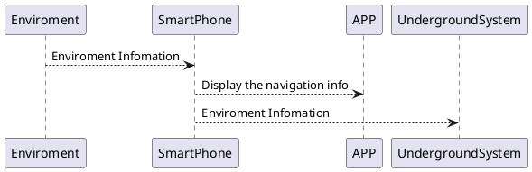

## 1. 平面图构建

1. 人群识别技术
2. 照片分析技术

    > SMF 和消失点检测

3. 图片平滑处理

<!-- more -->

## 2. 室内定位

1. 三角定位
2. Benchmark Image 是否有来源？

## 3. 载具追踪与导航

1. 手机姿态检测
2. 机器学习方面（蒙特卡洛框架）
3. 3D 模型 -> 1D 模型

## 4. 项目架构

### 4.1 模块关系

