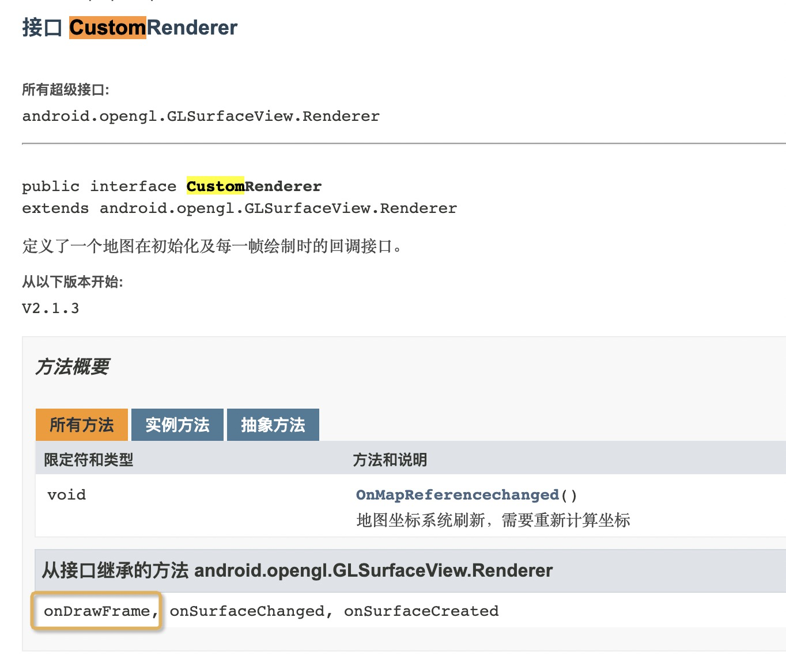

最近公司要求实现一个轨迹回放功能，想着 JS 都有 demo 的功能，Android 实现起来不还是小菜一碟？

结果显然是我太拿衣服了

<!-- more -->

## 0. 太长不看

全篇都采用高德 API 实现，基于 [`3dmap 6.9.2`](https://bintray.com/bintray/jcenter/com.amap.api%3A3dmap/6.9.2) 包

使用 `MovingPointOverlay` 实现点的平滑移动

使用 `AMap.setCustomRenderer` 获取每帧回调，绘制走过的线路

## 1. 需求分析

轨迹回放的功能在高德的 [JS Demo](https://lbs.amap.com/api/javascript-api/example/marker/replaying-historical-running-data/?sug_index=1) 上有，具体来说就是点按照既定路线去移动，同时绘制其走过的路线。

那么我们可以将功能拆解为移动点和绘制线路

本来我想着这种常见的功能在网上随便搜搜就能找到的，然而显然是我太 Naive 了。

搜到的唯二相关的内容，其中一个排版很差，而且估计是公司内部代码，没有给出 demo，第二个则是硬怼一个自定义 View，但是地图肯定是要移动放大之类的，自定义 View 也需要做手势控制，实现难度相对较大。

所以最好还是在高德内部框架上实现这个需求。

## 2. API 调研

经过一番查找之后，我找到了 `SmoothMoveMarker` 可以实现点的平滑移动功能，然而：

这里不得不吐槽一下高德的混淆策略，它不仅混淆了代码，同时还把文档混淆了，明明各部分文档都是公开的，将其保留在源代码里面也不会增大多少空间，然而这样全部删掉，导致我不得不切一个网页去看它的 API doc，开发效率急剧下降

在查看了高德地图的 API doc 之后，发现这个类是被 `MovingPointOverlay` 替代了，也就是说我们需要采用 `MovingPointOverlay`  实现点的平滑移动

## 3. 获取点位置回调

在 `MovingPointOverlay` 的 [API doc]() 中，有一个方法叫 `setMovingListener`，当时的我想当然的认为这个就是点移动时的回调设置方法，因此把画线的逻辑放到了里面去。

原先我将动画的总时间设置为 10 秒，此时点跑得比较快，乍一看没什么问题；
但是当我将动画的时间拉长，点跑得很慢的时候，问题就出现了—— `setMovingListener` **并不是每帧回调！**

也就是说，只有当 Marker 跑到下一个路径点的时候，才能绘制上经过的路线！

这显然会导致线路绘制不平滑，达不到需求的要求。

那怎么办呢？这时候我就进入了一段瞎糊弄的时间，尝试着通过自行实现动画效果来完成需求，然而无论是经纬度计算、屏幕像素计算都存在误差，不太可能在短时间能将需求实现。

正当我想着『万策尽きた！』，无聊浏览高德地图 API doc 的时候，突然发现 `AMap` 有个 `runOnDrawFrame()` 方法，是用来触发高德地图的重绘的；

既然有这个方法，那就一定有绘制的回调方法！功夫不负有心人，在往下看了几行之后，我终于发现了这个重要的方法 `setCustomRenderer()`，而且两者意外的离的很近：

这个方法接受一个 `CustomRenderer` 参数，那么什么是 `CustomRenderer` 呢？

从这里看，它有一个 `onDrawFrame()`，正是绘制每一帧的回调接口，那么我们只要将画线逻辑放到里面去就可以了。

当然，我们也不能抛弃 `setMovingListener`，因为我们需要它来判断是否已经到达终点。

## 4. 实现逻辑

1. 使用 `MovingPointOverlay` 实现点的平滑移动
2. 使用 `AMap.setCustomRenderer` 获取每帧回调，绘制经过的线路
3. 使用 `MovingPointOverlay.setMovingListener` 判断是否已经到达终点，如果到达终点，则清除经过线路的点

## 5. 坑点

无论是 `setCustomRenderer` 还是 `setMovingListener`，它们的回调都是在 OPEN GL 线程回调，而**不是在主线程回调**

因此，如果需要在动画完毕之后更改 UI，就必须使用 `runOnUiThread`，否则无论你怎么在里面更改 UI，都不会有任何效果

## 6. Demo

[https://github.com/wafer-li/AMapReplayDemo](https://github.com/wafer-li/AMapReplayDemo)
