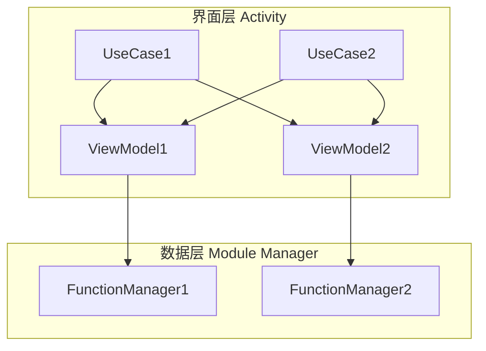

Android App 的技术架构经过多年演进之后，形成了目前 Google 在 Jetpack 中推崇的 MVVM 架构。

但是 Google 官方推崇的 MVVM 是多界面的 MVVM，即多个界面在同一个功能模块中，UI、数据如何进行组合的问题；

而现在的 Android App 基本上是大而全的，特别是直播系的 App，有时候单单一个直播 Activity 就有十几二十个功能点，假如采用 Google 的 MVVM 解决方案，就会造成单个 Activity 过于臃肿的问题，这和 Google 多年来想解决的 Activity 膨胀问题是相互矛盾的。

因此，这里就来介绍一种我在之前的公司所使用的用于解决单个界面功能过于复杂的 MVVM 架构。

<!-- more -->

## 1. 总体目标

对于这里的这个 MVVM 架构，它的总目标是清晰的，就是解决在直播系 App 中，单个界面所包含的功能点过于繁杂，导致代码结构不清晰的问题。

用比较高情商的话来说，就是 **「分离关注点」**！

## 2. 架构分层

对于 MVVM 架构来说，可以粗略的分为两层：

1. 界面层
2. 数据层

然后 ViewModel 在这两层之中充当桥梁的作用。

## 3. 界面层

本文所描述的架构需要重点解决的问题就在这一层中。

既然 Activity 的业务过于繁重，那么我们就需要对其进行拆分；

那么就需要使用一个新的概念来充当 Activity 各种功能点的业务容器，在这里我将其命名为 **UseCase**。

在这一层中，主要涉及以下概念，下文会对它们和其职责进行详细介绍:

1. Activity
2. UseCase
3. ViewModel

### 3.1 Activity

将 Activity 划分为多个 UseCase，分为独立的功能块，达到关注点分离的目的。

对此，针对 Activity 有如下要求：

1. Activity xml 不包含实际控件，使用 `<include>` 引入各个功能块视图
2. Activity 类包含各个 UseCase
3. Activity 包含例如`onBackPressed()`、`onKeyDown()`、`onActivityResult()` 的相关处理
4. Activity 为其中的 UseCase 添加各种监听事件和注入生命周期。

### 3.2 UseCase

::: tip
UseCase 的名称受到 [JetPack-MVVM-Best-Practice](https://github.com/KunMinX/Jetpack-MVVM-Best-Practice) 的启发

在此特地声明
:::

UseCase 在本架构中，实际上充当了一个功能点的角色，那么对于一个功能点来说，它应当具备以下的几个要件：

1. UseCase 应当具备界面
2. UseCase 应当具备操纵数据的 Handler
3. UseCase 应当具备 Activity 相关生命周期的处理能力

针对这几个需求，可以设计 UseCase 的构造器的参数:

1. `ViewBinding`，是 UseCase 的界面操作的入口，通过它可以获取 UseCase 相关的界面元素；实际上就是`<include>`进来的各个 layout
2. `LifecycleOwner`，用于为 UseCase 提供生命周期，在这里由 Activity 承担
3. `ViewModelStoreProvider`，用于构建 UseCase 所需的 ViewModel，在这里也由 Activity 承担

同时，为了让 UseCase 具备生命周期的监听特性，让 UseCase 实现 `LifecycleObserver`，通过它可以使用 `OnLifeCycleEvent` 注解进行生命周期的相关相应和处理。

::: tip
这里利用了 [ViewBinding](https://developer.android.com/topic/libraries/view-binding) 的一个特性

ViewBinding 针对 `<include>` 标签会生成一个对应的 LayoutViewBinding 节点

使用这一特性，就可以对 UseCase 所使用到的界面元素进行隔离，防止其轻易的获取到与其不相关的 View 元素，从而能够减少复杂性和阅读代码的心智负担。
:::

### 3.3 架构关系和数据之间的通信

到这里，我们介绍了界面层中两个比较关键的概念，由于我们想解决的是单界面，多个功能点的问题，因此它们之间的关系就比较重要了，这里来梳理一下：

1. Activity 和 UseCase 是一对多的包含关系
2. UseCase 不能包含 UseCase，它应当是扁平的，否则会使得架构进一步复杂
3. UseCase 可以持有多个 ViewModel，但仅限于兄弟之间和 Activity 的 ViewModel，不能持有其他 Activity 的 ViewModel
4. UseCase 之间以及 UseCase 和 Activity 之间使用 ViewModel 进行通信，UseCase 通过 LiveData 的 observe 接收通信内容

整个通信框架类似电话线路：

1. 总机可以拨分机
2. 分机之间可以相互拨
3. 打电话到外部(其他 Activity)必须通过总机

同时，由于给各个 UseCase 传入的是同一个 `ViewModelStoreProvider`；

因此，同一个 Activity 下的 UseCase 可以共享 ViewModel，这样就能实现 UseCase 之间可以获取对方的操作接口，实现上文中的 **分机相互拨电话** 的功能。

## 4. 数据层

### 4.1 生命周期

从实践中来看，一般来说大而全的 App 都是分为各个模块的，因此对于一个功能模块的数据层来说，它也应该具备自己的生命周期。

这里参照 Activity 的生命周期，对数据层的生命周期设计如下:

1. onCreate
   > 数据层工作的最早阶段，如第一次登陆
2. onStart
   > 与数据层业务相关的页面被打开的时候，由 Activity 的 ViewModel 进行通知
3. onResume
   > 与数据层相关的界面到达前台的时候
4. onPause
   > 与数据层相关的界面进入后台的时候
5. onStop
   > 与数据层相关的界面关闭的时候，由 Activity 的 ViewModel 的 `onCleared()` 进行通知
6. onDestroy
   > 数据层工作的最后阶段，如登出

同时，还应该提供一个登陆的相关周期，处理掉线重连问题，这里设计为：

1. onLogin
2. onLogout

针对数据层的生命周期，还有一个特殊的坑点，就是 **界面的开启和关闭不是一定成对执行的**；

如果界面层存在一些卡主线程的东西，就会导致前一个 Activity 实例没有 onStop 的时候，后一个 Activity 实例就执行了 onStart；

因此对数据层的 onStart 和 onStop 的调用中要有 `runGenreation` 的概念；

在 onStart 时，生成新的 `runGenreation` 给界面层；

在 onStop 时，对比外界传入的 `runGenreation`，和内部的是否一致，如果不一致则不执行具体的业务流程。

### 4.2 Module Manager

整体功能块的数据层可以采用一个大 Manager，这里称为 Module Manager。

它可以用单例模式或者使用依赖注入框架进行注入。

主要功能：

1. 处理数据层的生命周期
2. 为各个功能点的 Manager(Function Manager)，提供引用点和 `CoroutineScope`

### 4.2 Function Manager

与各个功能点直接相关的就是 Function Manager，它继承数据层生命周期相关的接口，从而实现在数据层相关的生命周期的数据处理。

主要功能：

1. 实现各个模块的功能点
2. 持有具体数据以及通知的渠道(Flow 或者 LiveData)
3. 处理各种网络回调工作
4. 处理各种生命周期的回调工作

## 5. ViewModel 的职责

到这一阶段，我们的 MVVM 框架就大体设计完成了，在这里回顾一下 ViewModel 的相关职责：

1. 接收各个 Function Manager 的数据输出渠道，并转成 LiveData
2. Activity 的 ViewModel 还负责 Manager 的 onStart 和 onStop 的工作，需要记录对应的 runGenreation

## 6. 架构图

