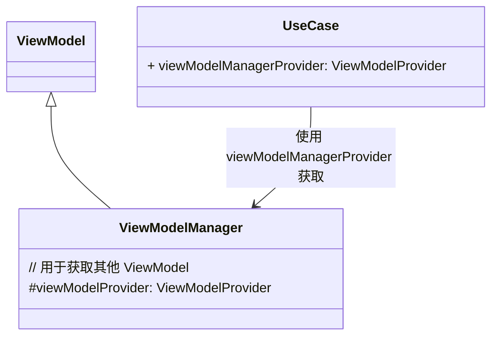

[上文](/blog-corners/tech/android/arch/android-单界面多功能点-mvvm-架构（一）)  提出了一种单界面多功能点的 MVVM 架构，但是尚存在一点问题，就是当某个特定的事件需要多个 UseCase 进行响应的问题。

例如直播的送礼物事件，需要礼物动画和送礼物的列表同时进行变化，在这里针对这个问题提出解决办法。

<!-- more -->

## 1. 从需求分析

我们可以从这个需求分析一下我们需要一些什么样的功能来实现我们这个需求。

首先，针对于 UseCase 之间的活动，我们可以通过他们的 ViewModel 对它们予以操控；因此，我们所提出的概念应该具备调用多个 ViewModel 的能力。

其次，这种跨 UseCase 的事件的发源地我们是无法确定的，它实际上和产品需求有关；因此，我们所提出的概念应该能够在多个 UseCase 获取到。

最后，它应该能处理 View 的生命周期问题，当 View 的生命周期结束时，它应当消除和它相关的一些变量等。

从这几点分析上来看，我们可以得出，我们需要的这个东西应当是一种**ViewModel**；

而这种 ViewModel 具备操作多个其他 ViewModel 的能力。

## 2. ViewModelManager

于是乎，我们为这个概念取名为 `ViewModelManager`；

首先，它继承于 `ViewModel`；

然后，通过给它传入 `ViewModelProvider`，我们就可以通过这个 Provider 去获取各类 ViewModel 的实例。

由于 `ViewModelManager` 是 ViewModel，那么它自然而然的能处理生命周期；

最后，为了能让多个 UseCase 能够获取到 `ViewModelManager`，我们需要给 UseCase 提供一个特殊的 **ViewModelProvider**，在这里称为 `viewModelManagerProvider`。

`ViewModelProvider` 是通过传入所需的 `ViewModel` 的 `Class` 来获取对应的 ViewModel 的实例的类；

具体来说，它在接收到 `ViewModel` 的 `Class` 之后，会从它的 `ViewModelStore` 中获取对应的 `ViewModel`；

如果没获取到，那么会使用 `ViewModelProvider.Factory` 来对 ViewModel 进行构建。

所以，我们需要为 `ViewModelManager` 提供一个能够构造它的 `Provider.Factory`；

针对这一步，我们直接照抄 `ViewModelProvider.Factory` 的源码，再注入 `ViewModelProvider` 即可。

那么通过构造 `viewModelManagerProvider`，我们就实现了在各个 UseCase 都能获取到某个 `ViewModelManager` 的功能。

::: tip
这里有个小坑点，由于默认的 `ViewModelProvider.Factory` 是通过 **反射** 构建新的 ViewModel 的；

因此，我们需要对 `ViewModelManagerProviderFactory` 配置混淆，让其构造函数不要被混淆处理，否则反射调用将会失败造成崩溃。
:::

## 3. 架构图

